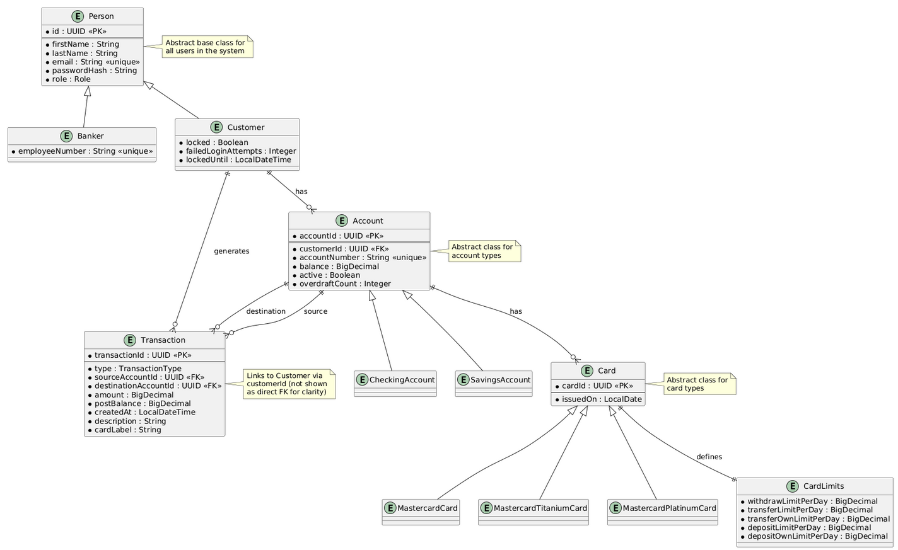

# GA Project #1: Banking with Java
A Java command-line banking application.

## Technologies Used
- Java 17
- Maven
- Jackson
- JUnit
- jBcrypt
- doenv-java
- Guava
- AES-GCM
- Diagrams using [Draw.io](draw.io)

## Trello Board
[Project Tasks](https://trello.com/b/NjTXqxpV/project-tasks)

## ERD Diagram
