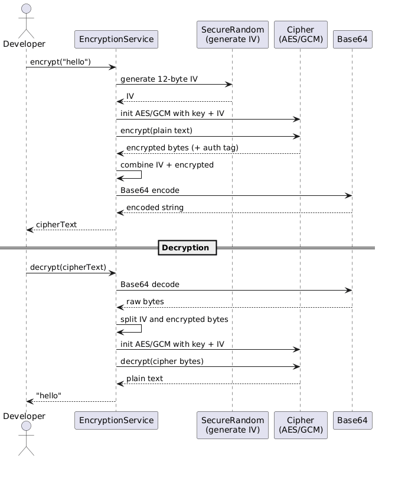
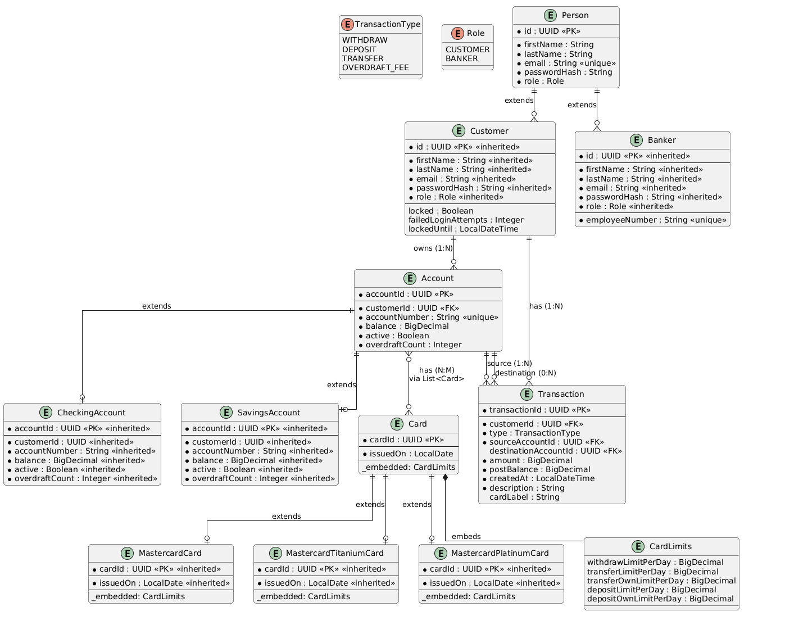

# GA Project #1: Banking with Java
A Java command-line banking application.

## Technologies Used
- Java 17
- Maven
- Jackson
- JUnit
- jBcrypt
- doenv-java
- Guava
- AES-GCM
- Diagrams using [Draw.io](draw.io)

## Trello Board
[Project Tasks](https://trello.com/b/NjTXqxpV/project-tasks)

## File Encryption/Decryption Feature

For implementing file encryption and decryption feature, I have used this [tutorial](https://jenkov.com/tutorials/java-cryptography/index.html) to understand java cryptography API and utilize it for this feature alongside reading through its [documentation](https://docs.oracle.com/javase/8/docs/api/javax/crypto/package-summary.html).

## ERD Diagram
